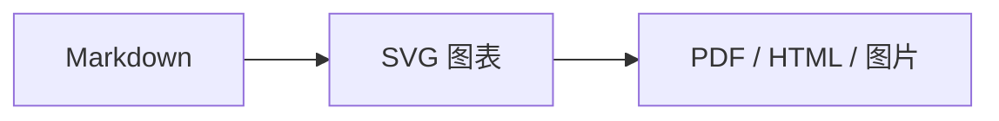

# Mory Markdown 编辑器

Mory 是一个跨平台 Markdown 编辑器。项目采用原生桌面宿主与共享 Web 编辑器内核，支持 macOS 和 Windows。界面结构、主题机制与导出链路参考本机 Typora 0.11.18 的可观察行为，全部业务代码和主题样式均为独立实现。

## 功能特性

- 支持所见即所得编辑和 Markdown 源码模式。
- 在空白行输入 `# `～`###### ` 后即时转换为对应标题。
- 支持打开、保存、另存为和 Markdown 文件关联。
- 支持多个独立工作区。默认使用本地目录，也可以配置 GitHub、S3、S4/S3 兼容存储、阿里云 OSS 和 SFTP Server 插件。
- 支持为每个工作区配置独立 Token、Access Key、用户名、密码、端口、私钥和远端路径。
- 粘贴或拖入图片时，自动写入文稿同名目录；文稿首次保存后，图片目录会跟随正式文稿名迁移。
- 支持同时创建多个未命名文档，切换时分别保留内容，保存后只重命名当前项；悬停侧栏文档可移除草稿或关闭文档，关闭已保存文档不会删除磁盘文件。
- 支持文件列表、实时大纲和快速打开。
- 支持查找替换、字数统计、专注模式和打字机模式。
- 支持 Mermaid 11.16.1 流程图、时序图、状态图等图表语法，运行时完全离线。
- 使用 Highlight.js 11.11.1 离线渲染代码高亮，编辑区和导出结果保持一致。
- 内置 Yuluo CSS、GitHub、Whitey、Newsprint、Pixyll、Gothic 和 Night 七套独立文档主题。Yuluo CSS 是默认主题。
- HTML 导出会内联选定主题，不依赖本机主题文件。
- PDF 导出支持 A4、US Letter 和 US Legal 纸张。
- 图片导出支持 PNG、JPEG 和 640～1,600 px 宽度。
- macOS 使用 Swift、AppKit 和 WKWebView；Windows 使用 Electron。

## 环境要求

### macOS

- macOS 13 或更高版本。
- Swift 6 或兼容版本。
- 仅开发和构建时需要 Node.js 22 和 Go 1.25 或更高版本。

### Windows

- Windows 10 或 Windows 11，x64 或 ARM64 架构。
- Node.js 22 或更高版本。
- npm 10 或更高版本。
- Go 1.25 或更高版本，用于构建存储插件侧车。

## 快速开始

安装依赖并启动 Electron 桌面版：

```bash
npm install
npm run dev
```

Electron 桌面版可在 macOS 和 Windows 上运行。两个平台共用同一套编辑器、主题和导出代码。

编辑区右下角固定显示纵向格式工具栏。工具栏默认只显示图标，鼠标悬停时显示功能名称。标题不提供 H1/H2 按钮，直接输入 `# `、`## ` 等 Markdown 标记；标题后按 Enter 会恢复为正文。中文输入法的候选确认回车不会提前退出标题，候选提交后立即按 Enter 也会同步创建正文，不会跳到文章顶部。连续输入多个标题会保持独立块。粘贴整段 Markdown 时同样会进入即时渲染管线。

输入 <code>```go</code> 后按 Enter 可创建 Go 代码块，代码块内的多行输入保持在同一个围栏中。代码会按围栏语言高亮；未声明语言时自动检测。进入代码块时，编辑器临时恢复纯文本 DOM 以保护光标；离开后重新高亮。光标位于最后一行时，连续快速按两次 Enter 会退出到下一段正文；按方向下键会打开代码语言和可选名称两个字段，左右键切换字段，再按一次方向下键保存信息并退出。代码名称使用 `title="main.go"` 围栏信息持久化，保存、重开及 HTML/PDF/图片导出均会保留。输入闭合围栏也可退出代码块。`**加粗**`、`*斜体*`、`~~删除线~~` 和成对反引号会在闭合标记输入完成后转换。

大纲会同步显示当前未保存文档中的标题。侧栏文档项悬停时显示关闭图标；移除未命名草稿会丢弃其未保存内容，关闭已有路径的文档则只退出当前会话。“显示状态栏”设置会即时隐藏或恢复底部状态栏。偏好设置只保留侧边栏左下角的齿轮入口。

## 使用工作区

点击侧栏底部的工作区名称，或打开“偏好设置 > 工作区与存储”。本地工作区可以直接选择目录。远端工作区先填写插件类型和独立凭证，再使用“拉取”和“推送”同步本地镜像。

同一种存储插件可以新增多个工作区。例如，可以同时配置两个 S3 Bucket 和多个 GitHub 仓库。Token、Secret、密码和私钥不会传给编辑器页面，也不会写入文稿目录或导出文件。

图片粘贴或拖入编辑器后，会保存到文稿同名目录。例如，`文章.md` 的图片位于 `文章/`。Markdown 始终使用相对路径。HTML 导出会内嵌图片，PDF、PNG 和 JPEG 使用同一份完整页面。

远端同步只新增或更新文件，不自动删除远端内容。完整字段说明、同步语义和插件扩展方式见 [docs/workspace-storage.md](docs/workspace-storage.md)。

## 构建 macOS 应用

推荐通过 Makefile 执行：

```bash
make package-macos
```

也可以直接执行 npm 脚本：

```bash
npm run build:mac
```

构建脚本会编译 Swift 宿主、复制 Web 资源并执行临时签名。输出文件位于：

```text
dist/macos/Mory.app
```

当前签名仅适合本机测试。对外分发前，需要配置 Apple Developer 证书、公证和 Staple 流程。

## 构建 Windows 应用

安装 GNU Make 后，执行以下命令生成 x64 和 ARM64 制品：

```bash
make package-windows
```

也可以在 Windows PowerShell 中只生成 x64 制品：

```powershell
powershell -ExecutionPolicy Bypass -File .\scripts\build-windows.ps1
```

脚本会执行语法检查、单元测试和 electron-builder 打包。输出目录为：

```text
dist\windows
```

默认生成 x64 NSIS 安装版和便携版。ARM64 版本可使用以下命令生成：

```bash
npm run pack:win:arm64
```

## 使用主题

打开“偏好设置”，在“文档主题”中选择主题。主题会同时影响编辑区和导出结果。默认的 Yuluo CSS 主题迁移自本机已有 `yuluo-css.css` 的正文排版与配色；实现移除了 Typora 专属选择器、远程字体请求和来源不明的字体文件，因此 macOS 和 Windows 均可离线使用。

导出时可以选择“使用当前主题”，也可以临时指定另一套主题。HTML 导出会把主题 CSS 写入文件，因此接收方不需要安装 Mory 或主题文件。

主题文件位于 `Sources/Mory/Web/themes/`。每套主题使用独立 CSS 文件，正文结构保持不变。这一机制便于后续增加自定义主题目录和 `*.user.css` 覆盖层。

## 使用 Mermaid

在 Markdown 中插入语言为 `mermaid` 的代码围栏：

````markdown

````

切换到预览模式后，Mory 会把代码块渲染为 SVG。图表会跟随当前文档主题重新配色。语法错误时，编辑区会保留原始代码并显示错误摘要。

Mory 内置 Mermaid 运行时，不会访问 CDN。HTML、PDF、PNG 和 JPEG 导出会内联已经渲染的 SVG，接收方不需要安装 Mermaid。

## 导出文档

点击编辑区右下角工具栏中的导出图标，然后选择格式、主题和格式专属选项。

### HTML

HTML 文件包含完整正文、基础打印样式和所选主题 CSS。导出过程不依赖 Pandoc。

### PDF

Windows 使用 Electron `printToPDF`。macOS 原生版使用 WKWebView 的打印操作。两端都从同一份主题化 HTML 生成 PDF。主题 CSS 在构建时内嵌到运行包，`file://` 页面导出不再读取跨源样式表。

### PNG 和 JPEG

应用会创建独立的离屏渲染页面，按指定宽度重新排版，再测量页面总高度并截图。单张图片高度上限为 28,000 px。超过上限时，应用会提示降低宽度或改用 PDF，避免生成被截断的图片。

## 验证

执行完整的本地检查、单元测试和 Electron 端到端测试：

```bash
make verify
```

也可以分别执行：

```bash
npm run check
npm test
```

执行 Electron 主题和导出端到端测试：

```bash
npm run test:e2e
```

该测试会实际生成带 Mermaid SVG 的 HTML、PNG 和 PDF，并检查主题、正文、大纲、文件签名和 PDF 页面信息。测试还会发送真实鼠标事件，验证侧栏、源码、导出、工作区凭证表单、快速打开、专注模式、打字机模式、格式栏和 macOS 窗口控制安全区。

macOS 还需要执行 WKWebView 专项冒烟测试：

```bash
npm run test:mac-web
npm run test:mac-typing
npm run test:mac-ime
npm run test:mac-drag
```

第一项测试使用与原生应用相同的 WKWebView 加载方式，实际生成并校验 HTML、PDF、PNG 和 JPEG；第二项通过原生 `NSEvent` 实际输入连续中文标题和多行代码，并验证双回车退出；第三项先放置 `#`，再通过系统简体拼音和物理键码输入空格、`nihao`、候选确认与 Enter，检查标题和正文光标位置，未启用简体拼音时自动跳过；第四项需要先构建 macOS 应用，用于验证标题栏指针坐标可以实际移动原生窗口。构建流程会先生成 `app.bundle.js`。该经典脚本解决 WKWebView 在 `file://` 页面中不执行 ES module 的兼容问题，并内嵌七套主题 CSS。

## GitHub Actions

`.github/workflows/build-binaries.yml` 使用 Makefile 目标完成验证和打包。推送到 `main`、提交拉取请求或手动触发工作流时，会生成 macOS ARM64、macOS x64、Windows x64 和 Windows ARM64 制品。制品保留 14 天，工作流不会自动发布 GitHub Release。

完整命令、运行器选择依据和回滚方式见 [docs/ci-packaging.md](docs/ci-packaging.md)。

最后验证日期：2026-08-16。

## 项目结构

```text
Electron/                 Windows 和跨平台 Electron 宿主
cmd/mory-storage/         跨平台存储插件侧车入口
internal/storage/         GitHub、S3/S4、OSS 和 SFTP 插件实现
.github/workflows/        GitHub Actions 多平台打包工作流
Sources/Mory/             macOS Swift 宿主
Sources/Mory/Web/         共享编辑器内核
Sources/Mory/Web/themes/  独立文档主题
Sources/Mory/Web/vendor/  构建生成的 Mermaid、Highlight.js 离线运行时与许可证
Tests/                    Markdown 单测与 Electron 端到端测试
macOS/                    macOS 应用元数据
scripts/                  双平台构建脚本
Makefile                  本地验证与打包统一入口
docs/                     架构与审计记录
```

## 已知限制

- 当前 Markdown 解析器覆盖标题、段落、列表、任务、引用、代码围栏、表格、链接、图片、Mermaid 和常用内联格式，尚未实现数学公式。
- macOS 原生导出代码已完成编译验证；Windows 安装包仍应在真实 Windows 机器上执行一次安装、文件关联和卸载回归。
- 当前版本没有代码签名证书。Windows 首次运行时可能显示 SmartScreen 提示。

## 设计来源

项目只参考 Typora 应用包的目录结构、公开资源组织和可观察交互。审计范围、证据与对应实现记录在 [docs/typora-audit.md](docs/typora-audit.md)。项目未复制 Typora 的压缩业务代码、商标、图标或原始主题 CSS。
